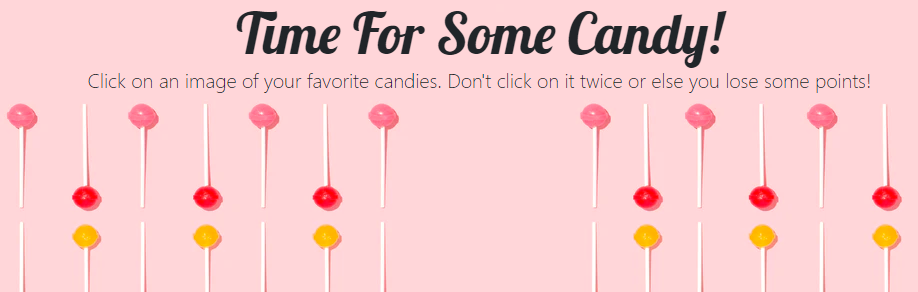
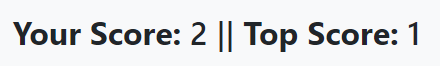
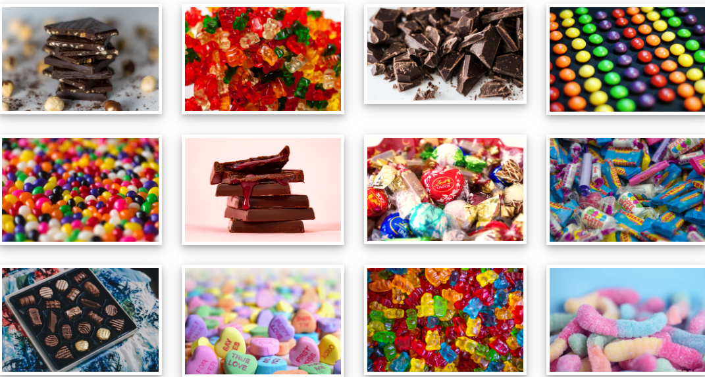
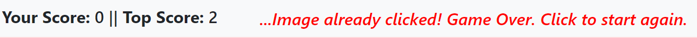

# Time For Some Candy - Memory Game  
This is the memory card game built with React.js. Check it out: https://mhvue.github.io/clickygame/

 

There is a scoreboard to track Your Score and the Top Score. 

Click on images.It will get shuffled after each click. Don't forget which image you clicked on. 

If same image clicked, the scores will reset and a message will pop up. 

## Technologies Used:
* CSS
* React.js
* Bootstrap

## To Do:
* The shuffle is not working properly. There are extra white spaces showing at random times.
